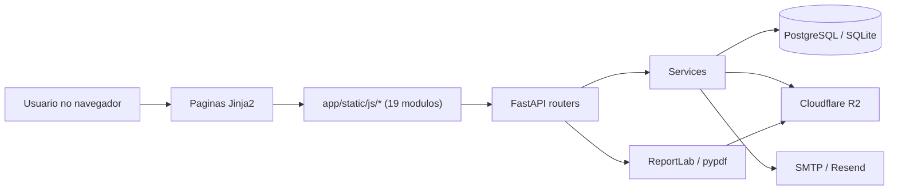
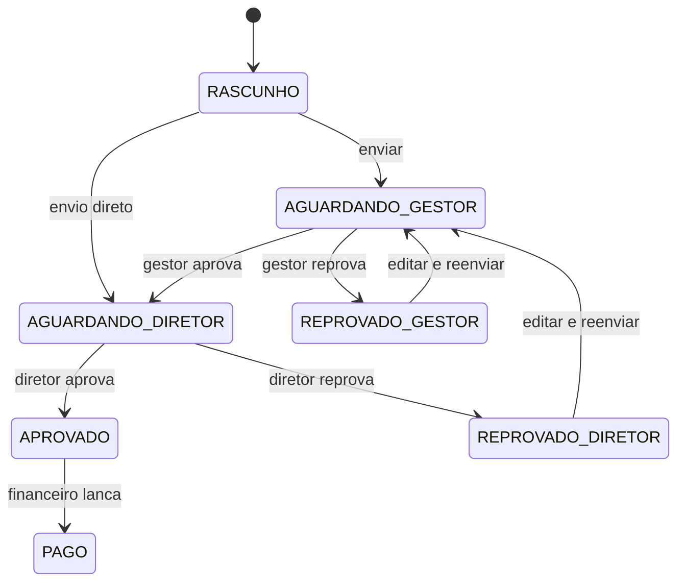
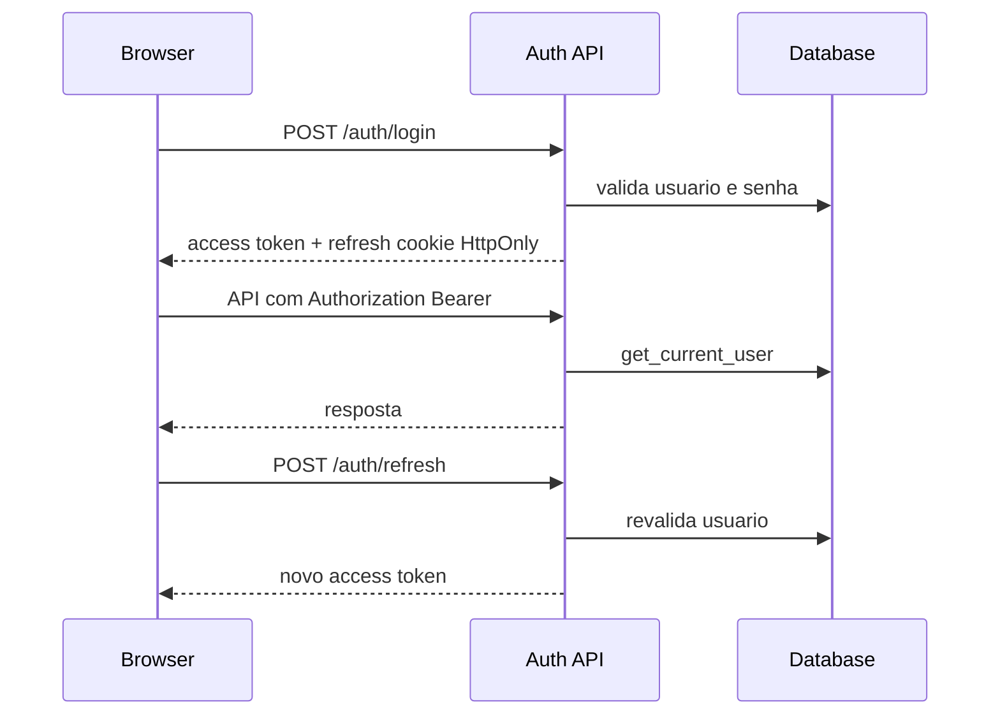
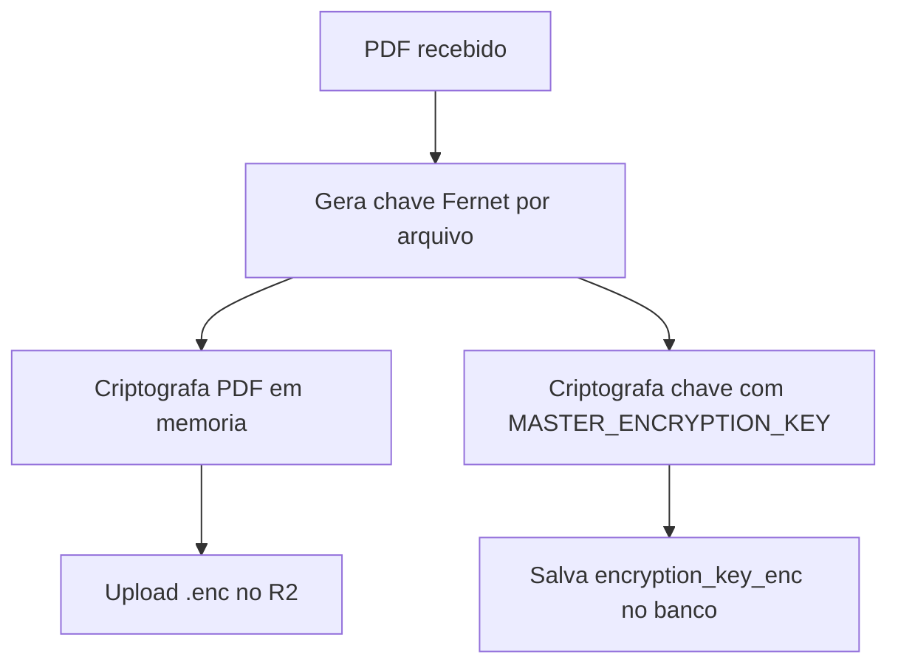

# Arquitetura do Sistema Economart

Visão geral da arquitetura. Para detalhes específicos por área,
consultar:

- [domain-model.md](domain-model.md) — papéis, fluxo de aprovação, FSM
- [security.md](security.md) — autenticação, criptografia, LGPD
- [database.md](database.md) — schema do banco
- [api-reference.md](api-reference.md) — endpoints HTTP
- [frontend.md](frontend.md) — templates, CSS, JavaScript
- [operations.md](operations.md) — deploy e troubleshooting
- [testing.md](testing.md) — suite de testes

## Visao Geral

O Economart e uma aplicacao FastAPI com templates Jinja2 e JavaScript vanilla. O fluxo principal e a aprovacao de notas fiscais internas, com anexos PDF criptografados antes de armazenamento em Cloudflare R2 ou fallback local em desenvolvimento.

## Camadas

### Interface

- Templates em `app/templates/`.
- Estilos em `app/static/css/main.css`.
- Logica cliente em `app/static/js/` (19 modulos vanilla, sem build).
  Ver [frontend.md](frontend.md#módulos-js) para mapa completo.

Responsabilidades:

- Navegacao por perfil.
- Formularios e validacao preliminar.
- Listagens, drawers, comentarios e viewer PDF.
- Chamadas autenticadas para APIs.

### API

Routers principais:

- `app/routers/auth.py`: login, refresh, logout, senha, disponibilidade.
- `app/routers/pages.py`: paginas HTML com guarda por cookie.
- `app/routers/invoices.py`: CRUD, transicoes FSM, anexos, comentarios.
- `app/routers/admin.py`: usuarios, setores, auditoria, SMTP.
- `app/routers/print_routes.py`: comprovante PDF e verify publico.
- `app/routers/alerts.py`: alertas por perfil.

### Servicos

- `app/services/invoice_service.py`: regras de negocio da nota.
- `app/services/drive_service.py`: criptografia e storage.
- `app/services/email_service.py`: envio SMTP/Resend.
- `app/services/pdf_service.py`: comprovante de aprovacao.
- `app/services/alert_service.py`: alertas operacionais.

### Dados

Modelos principais:

- `User`
- `Department`
- `Invoice`
- `ApprovalHistory`
- `AuditLog`
- `InvoiceComment`
- `SmtpSettings`
- `PasswordResetCode`

## Fluxo de Nota

## Autenticacao

## Storage de PDFs

## Observabilidade

- **Request ID**: middleware atribui um UUID curto por request e
  ecoa no header `X-Request-ID`. Cliente pode enviar o próprio ID
  para tracing end-to-end. Logger `app` anexa `[req=...]` automaticamente
- **Health checks**: `/health/live` (liveness, sempre OK),
  `/health/ready` (checa DB com `SELECT 1`), `/health/dependencies`
  (R2 + email)
- **Logs estruturados**: timestamp ISO + level + request_id + logger
  name + mensagem. Correlação simples via `grep "req=<id>"`

## Riscos Arquiteturais Conhecidos

- Migrações manuais no startup misturam bootstrap de aplicação com
  evolução de schema. Adotar Alembic está no roadmap
- Rate-limit é em memória por processo — multi-worker do gunicorn
  divide o limite efetivo. Migrar para Redis está no roadmap
- Cache de CNPJ e tabela `password_reset_codes` crescem sem cleanup
  automático — TODO
- Sem backup off-site automatizado. Depende do plano do Railway

## Decisões de design importantes

- **Access token em memória, refresh em cookie HttpOnly**:
  protege contra XSS exfiltrar token via localStorage. Detalhes
  em [security.md](security.md#por-que-access-em-memória-e-não-em-localstorage)
- **Soft-check de duplicate em vez de UNIQUE no schema**:
  fornecedores diferentes no Brasil legitimamente reutilizam
  numeração de nota. UNIQUE composto quebraria dados históricos.
  Backend detecta no submit e devolve 409 com `confirm_duplicate`
  como bypass
- **SMTP só por variável de ambiente** (não pela UI): defesa
  contra admin malicioso interceptar códigos de reset.
  Detalhes em [security.md](security.md#defesa-contra-admin-malicioso)
- **Hash chain em audit_logs**: defesa contra tampering retroativo
  no banco. Detalhes em [database.md](database.md#audit_logs)
- **Server-side rendering sem build**: deploy direto, sem
  `node_modules`, sem etapa de bundle. O JS é dividido em 19
  módulos pequenos servidos diretamente pelo FastAPI; cada um é
  uma IIFE que expõe namespaces em `window.Economart.<modulo>`
  (P2-1 v3, jun/2026)
- **Fail-fast em PROD para secrets**: app não sobe se
  `SECRET_KEY` ou `MASTER_ENCRYPTION_KEY` estão vazias/padrão.
  Tela 503 amigável até config ser corrigida

## Roadmap técnico

Documentado em [decisoes-2026-06-03.md](decisoes-2026-06-03.md).
Resumo:

- Sentry/Loki para correlação centralizada de logs
- Backup off-site automatizado do Postgres
- R2 com versioning habilitado
- Webhooks para integração externa
- API tokens long-lived para ETLs
- OCR de PDF para pré-preencher campos
- Cleanup automático de cache de CNPJ e reset codes
- Multi-currency
- Audit log de leituras sensíveis (LGPD)
