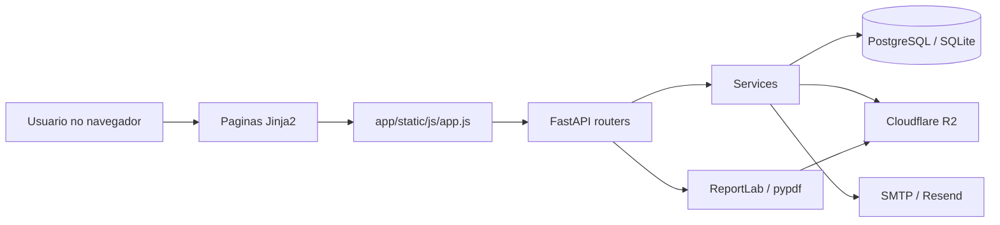
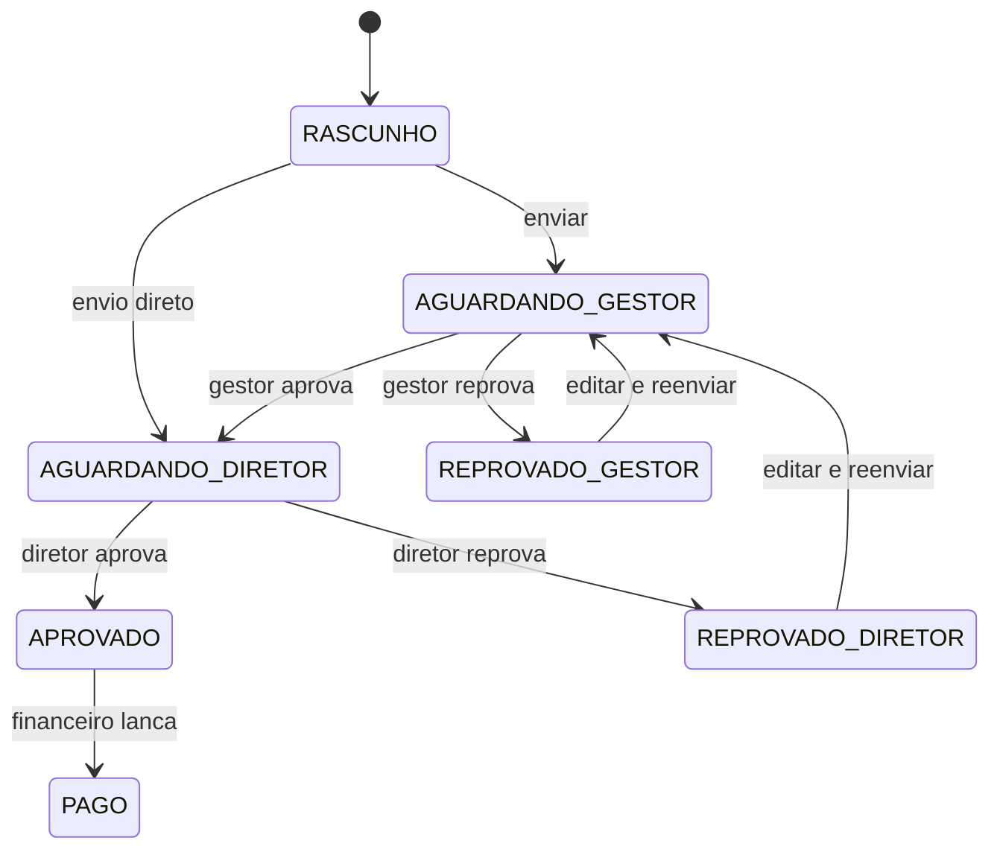
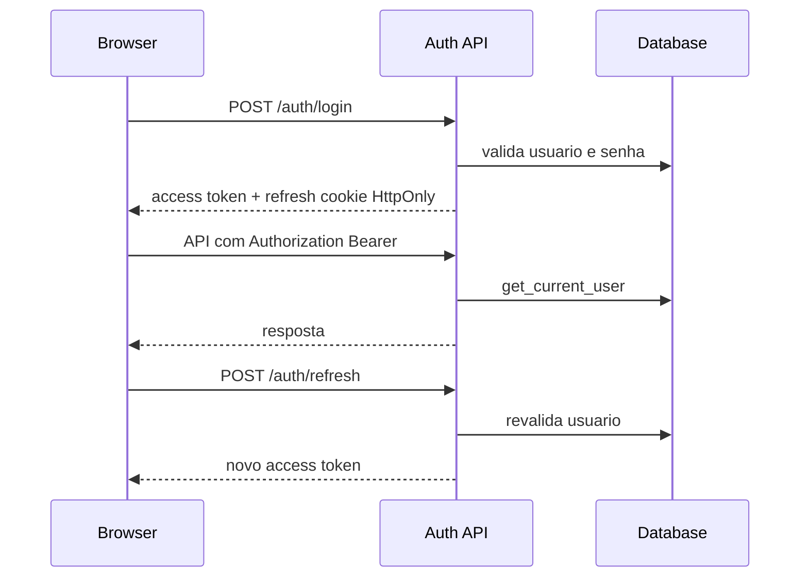
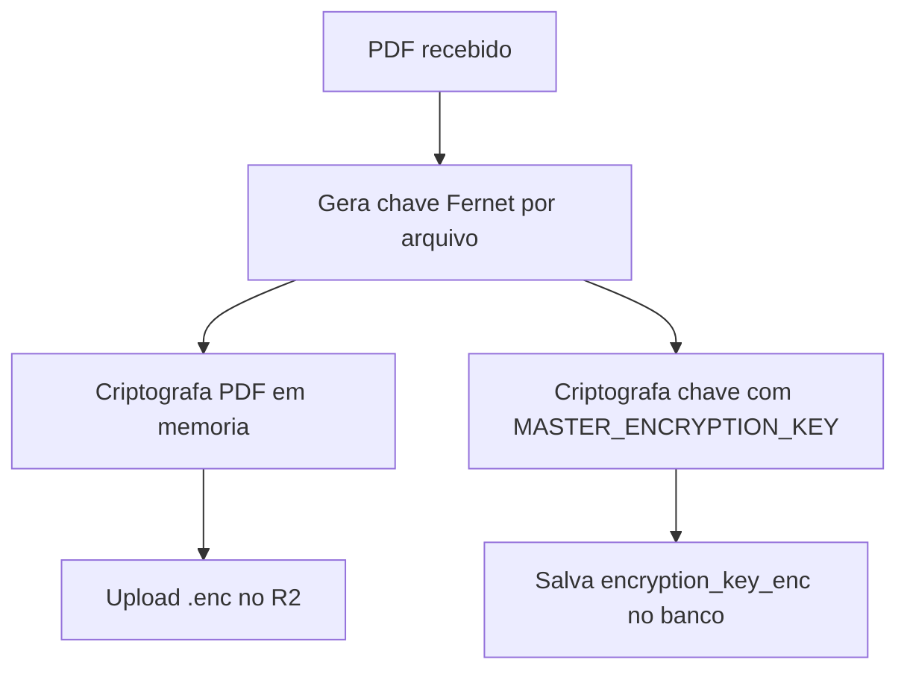

# Arquitetura do Sistema Economart

## Visao Geral

O Economart e uma aplicacao FastAPI com templates Jinja2 e JavaScript vanilla. O fluxo principal e a aprovacao de notas fiscais internas, com anexos PDF criptografados antes de armazenamento em Cloudflare R2 ou fallback local em desenvolvimento.

## Camadas

### Interface

- Templates em `app/templates/`.
- Estilos em `app/static/css/main.css`.
- Logica cliente em `app/static/js/app.js`.

Responsabilidades:

- Navegacao por perfil.
- Formularios e validacao preliminar.
- Listagens, drawers, comentarios e viewer PDF.
- Chamadas autenticadas para APIs.

### API

Routers principais:

- `app/routers/auth.py`: login, refresh, logout, senha, disponibilidade.
- `app/routers/pages.py`: paginas HTML com guarda por cookie.
- `app/routers/invoices.py`: CRUD, transicoes FSM, anexos, comentarios.
- `app/routers/admin.py`: usuarios, setores, auditoria, SMTP.
- `app/routers/print_routes.py`: comprovante PDF e verify publico.
- `app/routers/alerts.py`: alertas por perfil.

### Servicos

- `app/services/invoice_service.py`: regras de negocio da nota.
- `app/services/drive_service.py`: criptografia e storage.
- `app/services/email_service.py`: envio SMTP/Resend.
- `app/services/pdf_service.py`: comprovante de aprovacao.
- `app/services/alert_service.py`: alertas operacionais.

### Dados

Modelos principais:

- `User`
- `Department`
- `Invoice`
- `ApprovalHistory`
- `AuditLog`
- `InvoiceComment`
- `SmtpSettings`
- `PasswordResetCode`

## Fluxo de Nota

## Autenticacao

## Storage de PDFs

## Riscos Arquiteturais Atuais

- `app/static/js/app.js` e `app/static/css/main.css` concentram muitas responsabilidades.
- Migracoes manuais no startup misturam bootstrap de aplicacao com evolucao de schema.
- Alguns fluxos financeiros ainda combinam leitura e mutacao.
- Refresh token e paginas HTML usam mecanismos diferentes de guarda; devem compartilhar regras de invalidacao.

## Direcao Recomendada

- Separar frontend em modulos e CSS por camadas.
- Introduzir Alembic para migracoes.
- Separar comandos mutaveis de endpoints GET.
- Adicionar observabilidade com request id, logs estruturados e readiness check real.
- Criar testes de contrato para FSM, auth e financeiro.
