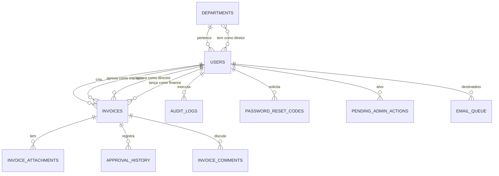

# Banco de dados — schema e operações

Este documento descreve o schema do banco, as relações entre tabelas,
estratégia de migração e queries importantes.

## Stack

- **Produção**: PostgreSQL (Railway managed)
- **Desenvolvimento**: SQLite (arquivo local `economart.db`)
- **ORM**: SQLAlchemy 2.x

O código abstrai diferenças entre os dois: `with_for_update()`
ignora em SQLite, extensão `unaccent` cai para `LOWER()` simples,
`ALTER TYPE ... ADD VALUE` é só para PG.

## Tabelas principais



### users

A tabela central. Cada pessoa que pode logar.

Colunas relevantes:

- `id` (UUID string, PK)
- `email` (varchar 255, unique, indexed)
- `name`
- `hashed_password` (bcrypt)
- `role` (enum `UserRole`: ADMIN, EMPLOYEE, MANAGER, DIRECTOR, FINANCE, CONTAS_A_PAGAR)
- `department_id` (FK para departments — o setor do usuário)
- `manager_id` (FK self — o gestor do usuário; só faz sentido para EMPLOYEE)
- `is_active` (boolean — encerrados ficam False)
- `must_change_password` (boolean — exigência de troca obrigatória)
- `password_changed_at` (timestamp — usado para invalidar tokens antigos)
- `last_login` (timestamp)
- `login_attempts` (int — contador de senhas erradas em sequência)
- `blocked_until` (timestamp — bloqueio temporário após 5 falhas)
- `unavailable_for_notes` (boolean — modo férias)
- `substitute_director_id` (FK self — diretor substituto durante férias)
- `substitute_manager_id` (FK self — gestor substituto durante férias)
- `submit_directly_to_director` (boolean — pula gestor ao enviar nota)

Índices: email (único), role, is_active.

### departments

Setores da empresa.

- `id` (UUID, PK)
- `name` (unique)
- `is_active`

Relações:

- N usuários por setor (`users.department_id`)
- M-N com usuários do tipo DIRECTOR via tabela `director_departments`
  (um setor pode ter vários diretores responsáveis, um diretor pode
  responder por vários setores)

### invoices

A nota fiscal. Coração do sistema.

- `id` (UUID, PK)
- `invoice_number` (varchar 100) — número impresso na nota física
- `issue_date` (date), `due_date` (date)
- `description` (text)
- `bank_details` (text, opcional)
- `amount` (numeric)
- `status` (enum `InvoiceStatus`)
- `created_by_id` (FK users, NOT NULL)
- `manager_id`, `director_id`, `finance_id`, `printed_by_id`
  (FKs users, todos opcionais, `ON DELETE SET NULL` para
  preservar audit em caso de delete físico)
- `created_at`, `submitted_at`, `manager_reviewed_at`,
  `director_reviewed_at`, `paid_at`, `printed_at`
- `description_at_rejection` (text) — snapshot da descrição no
  momento da reprovação. Reenvio só é aceito se a descrição
  atual diferir desse snapshot (anti-reenvio vazio)
- `supplier_document` (varchar 14, indexed) — só dígitos, 11 CPF
  ou 14 CNPJ
- `supplier_document_type` (varchar 4) — "CPF" ou "CNPJ"
- `supplier_name` (varchar 255) — nome fantasia
- `supplier_legal_name` (varchar 255) — razão social (CNPJ)
- `drive_file_id`, `drive_file_name`, `encryption_key_enc`
  (campos legados para o anexo principal; novos anexos vão na
  tabela `invoice_attachments` que suporta múltiplos)
- `print_drive_file_id` (id no R2 do comprovante gerado, se existir)

Índices manuais (criados em `main.py`):

- `idx_invoices_status` em status
- `idx_invoices_created_by` em created_by_id
- `idx_invoices_manager` em manager_id
- `idx_invoices_director` em director_id
- `idx_invoices_number` em invoice_number
- `idx_invoices_supplier_doc` em supplier_document
- Em PG: índices funcionais `idx_invoices_supplier_name_un`
  e `idx_invoices_description_un` usando `LOWER()` para
  busca case-insensitive
- Em PG: extensão `unaccent` instalada para busca
  acento-insensitive

### invoice_attachments

PDFs anexados às notas.

- `id` (UUID, PK)
- `invoice_id` (FK invoices, indexed)
- `original_name` (varchar 255)
- `drive_file_id` (chave do objeto no R2)
- `encryption_key_enc` (chave Fernet do arquivo, criptografada com `MASTER_ENCRYPTION_KEY`)
- `size_bytes`
- `uploaded_at`
- `uploaded_by_id` (FK users)

Limites:

- 1 a 5 anexos por nota
- 10 MB por arquivo
- 25 MB no total da nota

### approval_history

Timeline do que aconteceu com cada nota.

- `id` (UUID, PK)
- `invoice_id` (FK invoices, indexed)
- `user_id` (FK users) — quem agiu
- `action` (enum `ApprovalAction`: CREATED, SUBMITTED,
  APPROVED_MANAGER, REJECTED_MANAGER, APPROVED_DIRECTOR,
  REJECTED_DIRECTOR, MARKED_PAID, PRINTED, TRANSFERRED_DIRECTOR,
  CANCELLED, etc)
- `comment` (text) — motivo, mensagem, observação
- `timestamp` (timestamp UTC)
- `ip_address` (pseudonimizado via HMAC-SHA256, LGPD)
- `source_port` (porta lógica para individualização atrás de NAT)

### invoice_comments

Thread assíncrona de comentários (não confundir com `approval_history`).

- `id` (UUID, PK)
- `invoice_id` (FK invoices, indexed)
- `user_id` (FK users) — autor
- `body` (text, máx 2000 chars)
- `created_at`

Comentários são imutáveis (sem UPDATE/DELETE pela aplicação).
Para apagar precisa SQL direto no banco — proteção contra revisão
histórica acidental.

### audit_logs

Trilha completa de auditoria, com hash chain.

- `id` (UUID, PK)
- `user_id` (FK users, opcional — `ON DELETE SET NULL`)
- `action` (varchar 100) — ex: LOGIN, LOGOUT, CREATE_INVOICE,
  APPROVE, REJECT, MARK_PAID, ADMIN_CREATE_USER, etc
- `resource_type` (varchar 100) — INVOICE, USER, DEPARTMENT
- `resource_id` (varchar 100)
- `ip_address` (pseudonimizado, LGPD)
- `source_port`
- `http_method`
- `user_agent` (text)
- `timestamp` (timestamp UTC)
- `success` (boolean)
- `prev_hash` (varchar 64) — SHA256 do row_hash anterior
- `row_hash` (varchar 64) — SHA256 dos campos deste registro

Implementação do hash chain: listener em `attach_audit_chain_listener`
intercepta `before_flush` da SessionLocal. Para cada novo registro
de `AuditLog`:

1. Busca último `row_hash` (ORDER BY timestamp DESC, id DESC LIMIT 1)
2. Calcula `prev_hash = último_row_hash` (ou string vazia no primeiro)
3. Calcula `row_hash = SHA256(prev_hash + user_id + action + resource_id + timestamp_iso + ip)`
4. Grava ambos

Validação da cadeia: endpoint `/api/admin/audit-logs/verify-chain`
itera todos os registros em ordem e recalcula cada `row_hash`. Diferença
em qualquer ponto sinaliza tampering retroativo.

Limitação: verificação é full-scan. Em 100k+ registros vira lento.
Documentado como roadmap: adicionar checkpoints a cada N registros
para verificação incremental.

### email_queue

Fila persistente de emails para envio com retry.

- `id` (UUID, PK)
- `to_email` (varchar 320 — máximo RFC)
- `subject`, `html_body`, `text_body`
- `status` (enum `EmailStatus`: PENDING, SENT, FAILED) — indexed
- `attempts` (int)
- `max_attempts` (int, default 4)
- `next_retry_at` (timestamp) — quando voltar a tentar
- `last_error` (text — última mensagem de erro)
- `locked_at`, `locked_by` (marcador de qual worker está processando)
- `created_at`, `sent_at`
- `category` (varchar 64, indexed) — ex: reset_password,
  invoice_approval_notify

Workflow:

1. `enqueue_email()` insere com `status=PENDING`, `attempts=0`,
   `next_retry_at=now()`
2. Worker assíncrono em background drena a cada 15s:
   `SELECT FOR UPDATE SKIP LOCKED` (PG) ordenado por `next_retry_at`,
   limita a 25 registros por batch
3. Para cada registro pega: tenta enviar via SMTP/Resend
4. Se sucesso → `status=SENT`, `sent_at=now()`
5. Se falha → `attempts += 1`. Se `attempts >= max_attempts` → `status=FAILED`.
   Senão → `next_retry_at = now() + backoff(attempts)` onde backoff é
   1, 4, 16, 64 minutos

Lock stale (>5min sem update) é liberado automaticamente em cada
ciclo do worker — cobre crash de worker no meio do envio.

Em multi-worker do gunicorn, `SELECT FOR UPDATE SKIP LOCKED` garante
que dois workers não peguem o mesmo registro.

### pending_admin_actions

Ações sensíveis do admin com janela de 24h para veto.

- `id` (UUID, PK)
- `action_type` (enum) — CREATE_ADMIN, CREATE_DIRECTOR, CLOSE_USER
- `actor_id` (FK users) — quem iniciou
- `target_user_id` (FK users)
- `target_role` (varchar)
- `payload_json` (text) — dados da ação serializados
- `status` (enum `PendingActionStatus`: PENDING_GRACE, EXECUTED,
  VETOED, EXPIRED), indexed
- `vetoed_by_id` (FK users, opcional)
- `veto_reason` (text, opcional)
- `created_at`, `executes_at` (created_at + 24h)
- `executed_at`

Job no startup verifica se há registros com `executes_at < now()` e
status `PENDING_GRACE` para promover automaticamente.

### password_reset_codes

Códigos de recuperação de senha (6 dígitos numéricos).

- `id` (UUID, PK)
- `user_id` (FK users, indexed)
- `code_hash` (bcrypt do código — código bruto nunca fica no banco)
- `expires_at` (created_at + 10 min)
- `attempts` (int) — limite 5
- `used_at` (timestamp, null se ainda não foi usado)
- `created_at`

Política: código tem 5 minutos de validade, máximo 5 tentativas,
não pode reutilizar após sucesso, novos códigos invalidam os
anteriores do mesmo usuário.

### cnpj_cache

Cache local de consultas à API externa de CNPJ.

- `id` (UUID, PK)
- `cnpj` (varchar 14, unique)
- `data_json` (text — resposta da API)
- `created_at`

TTL: 180 dias na leitura. Sem cleanup automático (documentado como
roadmap).

### smtp_settings

**Tabela legada, não usada.** Antes o admin configurava SMTP pela UI;
hoje a configuração só vem de variáveis de ambiente
(defesa contra admin malicioso). Tabela mantida pra não quebrar
migrações de instalações antigas.

---

## Migrações

O sistema **não usa Alembic**. Migrações são SQL puro executado no
startup em `app/main.py:_run_schema_migrations()`.

A função roda uma lista de comandos `ALTER TABLE ... IF NOT EXISTS`
e `ALTER TYPE ... ADD VALUE IF NOT EXISTS` em ordem, ignorando
silenciosamente quando o comando falha (já aplicado ou não suportado
em SQLite).

Vantagens da abordagem simples:

- Zero infra adicional (sem `alembic init`, sem pastas de revisão)
- Migrations são `git diff -p app/main.py` — fácil de revisar em PR
- Funciona em qualquer ambiente (PG ou SQLite)

Desvantagens (documentadas):

- Sem rollback automático
- `ALTER TYPE ADD VALUE` em PG é irreversível sem dump/restore
- Adicionar Alembic está no roadmap quando o time crescer

Ordem importante: as migrações rodam **antes** do bootstrap do admin
default. Sem isso, queries do bootstrap explodem por colunas
ausentes em bancos antigos.

---

## Padrões de query

### Eager loading

`get_invoices_for_user` aceita parâmetro `light=True`. Quando True,
usa `_invoice_options_light()` que carrega só `created_by`, `manager`,
`director`, `finance` via `selectinload`. Sem `attachments` e
`approval_history` (os caros).

Detail (`/api/invoices/{id}`) continua com loader completo
(`_invoice_options()`) — quem chama o detail quer ver tudo.

### Visibilidade por role

`_query_visible_invoices(db, user)` aplica filtro `WHERE` conforme
o role do usuário:

- ADMIN: tudo
- EMPLOYEE: `created_by_id == user.id`
- MANAGER: `manager_id == user.id`
- DIRECTOR: `director_id == user.id OR created_by_id == user.id`
  (cobre self-submit)
- FINANCE: `status IN (APROVADO, PAGO)`
- CONTAS_A_PAGAR: tudo (mas escrita bloqueada por `require_role`)

### Busca textual

Em PG, queries usam `unaccent(LOWER(coluna))` para busca
acento-insensitive. Em SQLite cai para `LOWER(coluna)` simples
(fallback).

Cobertura:

- Número da nota
- Descrição
- Nome fantasia do fornecedor
- Razão social
- CPF/CNPJ (só dígitos quando 3+ dígitos digitados)

---

## Conexão e pool

Em `app/database.py`:

- `engine = create_engine(DATABASE_URL, ...)` com pool padrão do
  SQLAlchemy (5 conexões + 10 overflow)
- `SessionLocal = sessionmaker(autocommit=False, autoflush=False)`
- `get_db()` injetada como dependency em todos os endpoints
- Cada request abre uma sessão, executa, fecha (yield + finally)

Para queries fora do contexto de request (workers, jobs de startup),
usamos `with SessionLocal() as db: ...` diretamente.

---

## Backup e restore

**Estratégia atual**: Postgres do Railway tem backup automático do plano.
Não há backup off-site adicional (documentado como roadmap — risco
de incidente catastrófico no provedor).

**Procedimento manual de backup**:

```bash
# Dump
pg_dump $DATABASE_URL > backup-$(date +%F).sql

# Restore (em banco vazio)
psql $DATABASE_URL_NOVO < backup-2026-06-03.sql
```

**Anexos no R2**: o R2 da Cloudflare tem replicação interna mas sem
versioning habilitado (documentado como roadmap). Delete acidental
é definitivo. Procedimento de backup do bucket fica como TODO.

---

## Onde isso vive no código

| Conceito | Arquivos |
|---|---|
| Engine + Session | `app/database.py` |
| Modelos | `app/models/*.py` |
| Migrações manuais | `app/main.py:_run_schema_migrations` |
| Bootstrap admin | `app/main.py:_ensure_admin_exists` |
| Queries de invoice | `app/services/invoice_service.py` |
| Hash chain audit | `app/models/audit_logs.py:attach_audit_chain_listener` |
| Worker email queue | `app/services/email_queue_service.py` |
| Purge auto de reprovadas | `app/main.py:_purge_old_rejected_on_startup` |
